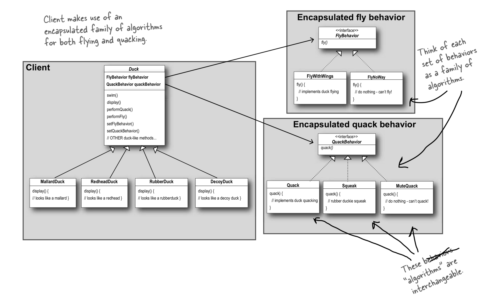

= Strategy Pattern(전략 패턴)
Park Bokuk <limited107@gmail.com>
:toc:
:sectnums:

[.lead]
Strategy Pattern에 대해 설명합니다. (Head First Design Patterns - 1장)

== Strategy Pattern
알고리즘군을 정의하고 각각을 캡슐화해서 교환해서 사용할 수 있도록 한다. Strategy Pattern을 활용하면 알고리즘을 사용하는 Client와는 독립적으로 알고리즘을 변경할 수 있다.

== 디자인 원칙
* Identify the aspects of your application that vary and separate them from what stays the same. +
애플리케이션에서 달라지는 부분을 찾아내고, 달라지지 않는 부분으로부터 분리시킨다.
* Program to an interface, not an implementation. +
구현이 아닌 인터페이스에 맞춰서 프로그래밍한다.
* Favor composition over inheritance. +
상속보다는 구성을 활용한다.

