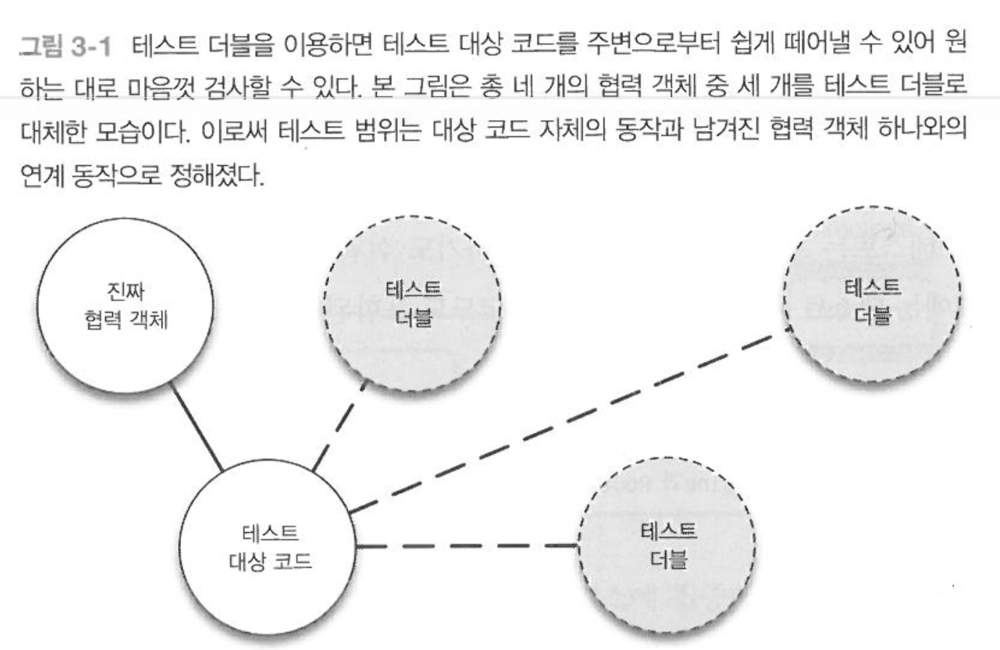

= 테스트 더블(Test Double)
외부 인터페이스 스펙은 정의됐지만, 테스트가 불가한 상태인 경우 테스트 더블을 사용할 수 있다.
.테스트 더블의 특징
* 테스트 대상 코드 격리
* 테스트 속도 개선
* 예측 불가능한 실행 요소 제거
* 특수한 상황 시뮬레이션 가능
* 감춰진 정보를 얻을 수 있음

== 테스트 더블의 위력 

=== 테스트 대상 코드를 격리한다
테스트하려는 코드를 그 외의 모든 코드에서 떼어 놓겠다.

===